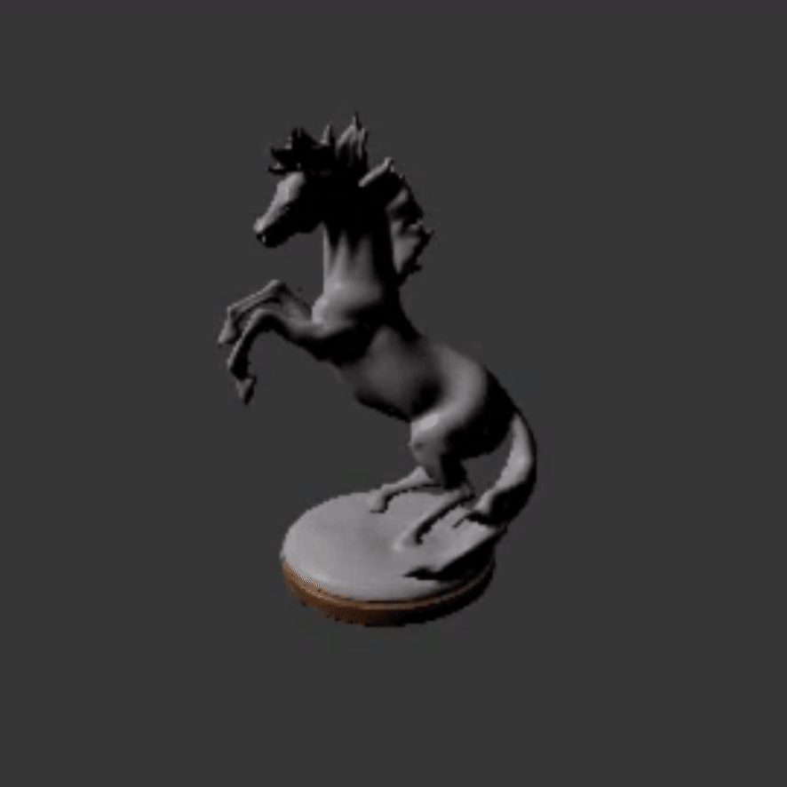
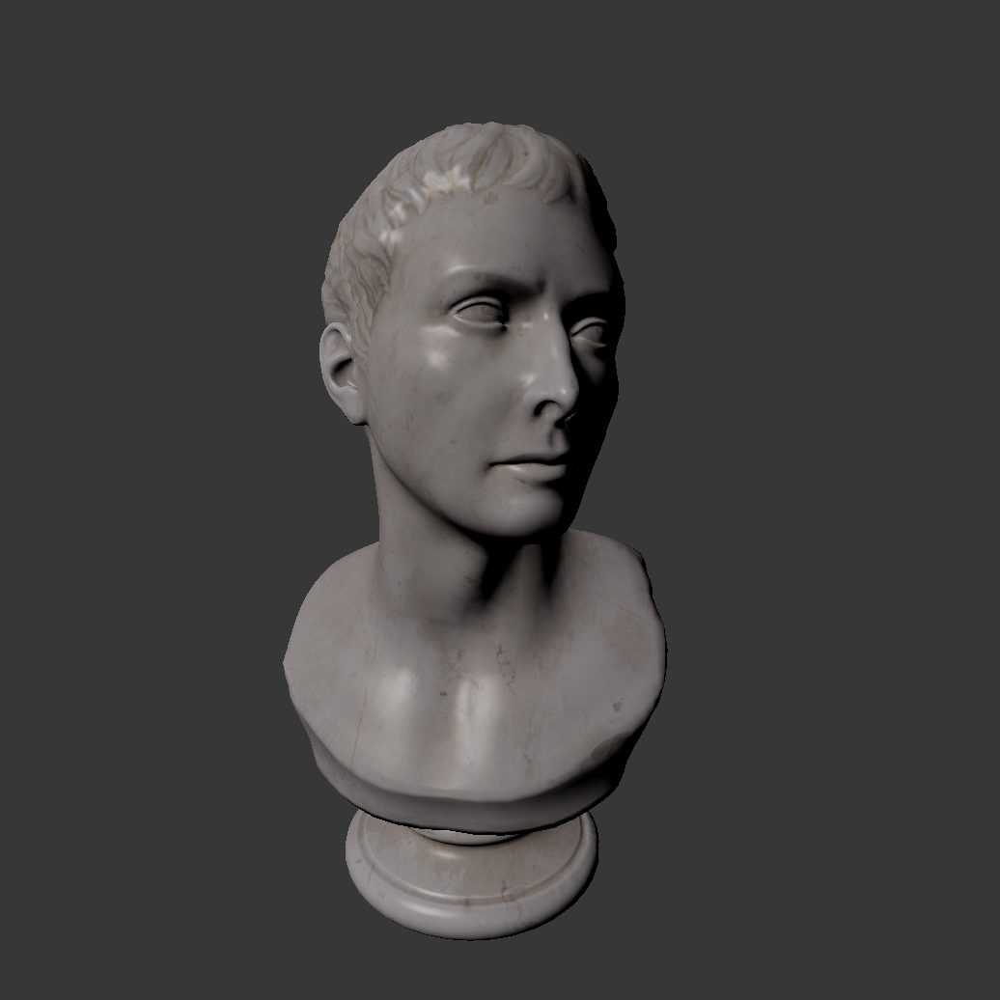
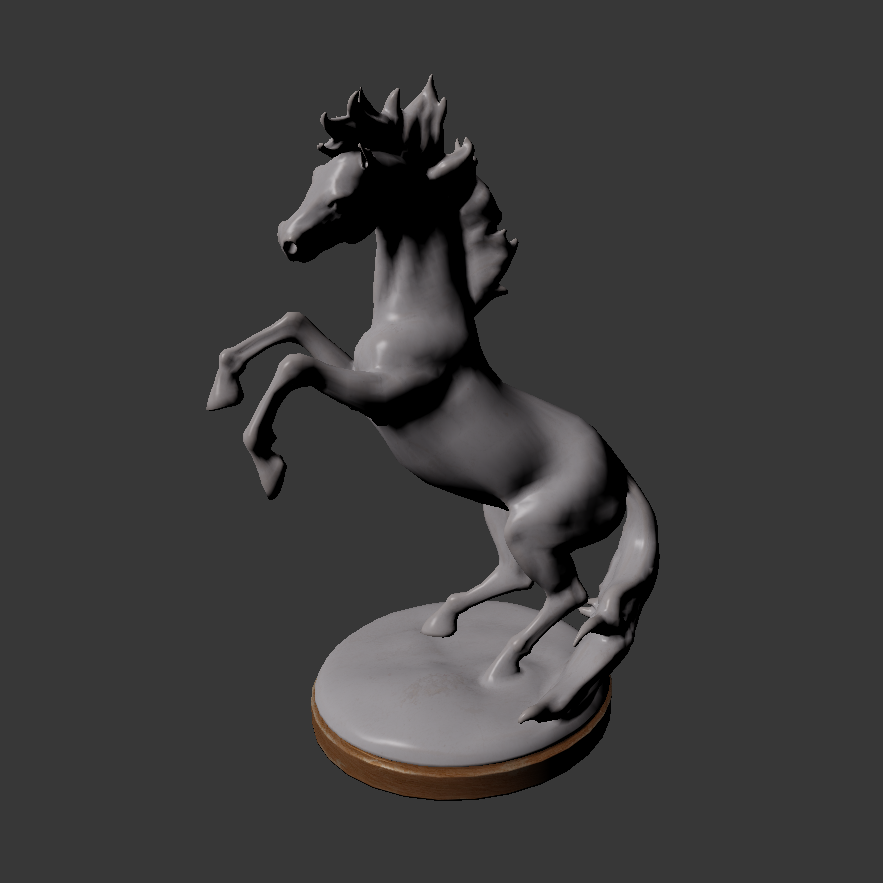

# Software Rasterizer written in C#
 
A rasterizer I wrote to learn about the rasterization process and interactive 3D applications.

Supports:
- Triangle rasterization
- Line rendering
- Perspective correct texture sampling 
- Loading and rendering obj meshes
- Blinn-Phong lighting with point lights



## Running the demo

The project was made using C# 10.0 ([Dotnet 6.0](https://dotnet.microsoft.com/en-us/download/dotnet/6.0))

The demo can be run using the dotnet cli command:
```sh
dotnet run --project ./RasterDemo -c Release
```

## More detail

[More detailed description of how it works](./Docs/detail.md)

## Example Screenshots




## Third Party Content

- SFML
    - https://www.nuget.org/packages/SFML.Net/
- Polyhaven Demo Models
    - Horse Statue by Rico Cilliers (https://polyhaven.com/a/horse_statue_01)
    - Marble Bust by Rico Cilliers (https://polyhaven.com/a/marble_bust_01)

## License

This project licensed under the MIT Open Source License.
See the [license](./LICENSE) file for details.  